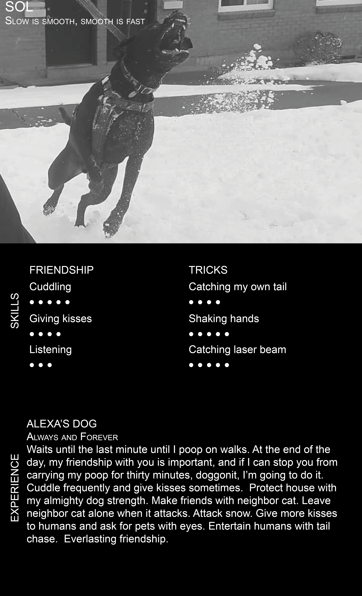
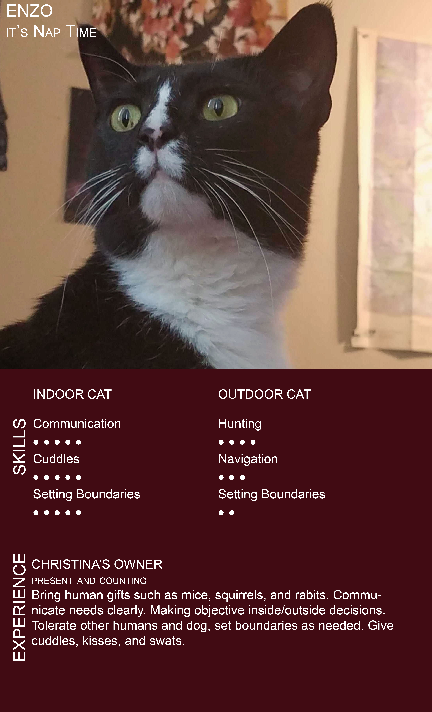

# Genieva's Projects
A collection of projects from my professional experience, personal work, and hackathons.

### Pet Resumes
In my growing obsession with InDesign, I created pet resumes to showcase my design capabilities. 

### FareHarbor
Web Content Specialists create resumes for FareHarbor clients. Once sites go live, a Live Sites Specialist train the clients to edit their sites so that they can keep their activities updated. I am listing my favorite clients, they offer interesting activities in their region. 
<a href="https://www.puertoricobiobaytours.com/" target="_blank"> Puerto Rico Bio Bay Tours</a>    
<a href="https://snohomishballoonride.com/"> Snohomish Balloon Rides</a>  
<a href="https://milwaukeekayaktours.com/"> Milwaukee Kayak Tours</a>  
<a href="https://www.oldcovecanoe.com/"> Old Cove Canoe</a>  
<a href="https://www.localtastesofnashville.com/"> Local Tastes of Nashville</a>  
<a href="https://wolfcreeksleighrides.com/"> Wolf Creek Sleigh Rides </a>

### Sasona
Sasona is a housing co-op located in South Austin. The previous website, built in the early 2000s, was difficult to navigate and not responsive. I took on rebuilding Sasona's website to learn website design and make the new site more user and mobile friendly. <a href="https://sasona.org" target="_blank">Sasona.org</a>

### Intel Joule Hackathon November 2016
For the Intel Joule Hackathon, I worked on programing the <a href="https://software.intel.com/en-us/iot/hardware/joule" target="_blank">Intel Joule</a>  to receive distance data from a camera that cyclists can clip on the back of their helmet. They would receive a vibration in the helmet to let them know there is an object accelerating behind them and they should move over. If there was a collision the camera would store the video and upload it to the user's account where they can retrieve the video from a web or app portal.
    

### StartOut hackathon February 2015
<a href="https://startout.org" target="_blank">StartOut </a> is a non-profit advocating for LGBTQ entrepreneurs, who host hackathons in various locations. I joined a group called "Follow the Music". We created a prototype for an app that would play music in the direction you needed to turn as a part of your directions. I created the User Interface in Proto.io.

 

