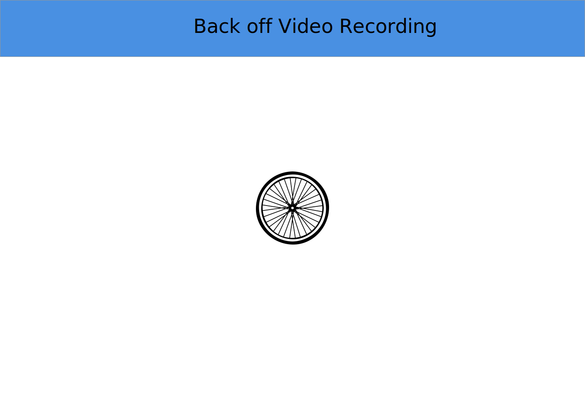

### Sasona
Sasona is a cute little co-op located in South Austin. The old website hadn't been updated in ages, and was difficult to navigate. I wanted to make the new site more user-friendly. I think everyone is happier with the new site at <a href="https://sasona.org" target="_blank">Sasona.org</a>

### Intel Joule Hackathon November 2016
 For the Intel Joule Hackathon, I worked on programing the <a href="https://software.intel.com/en-us/iot/hardware/joule" target="_blank">Intel Joule</a>  to receive distance data from a camera a cyclists can clip on the back of their helmet. They would receive a vibration in the helmet to let them know there is an object accelerating behind them and they should move over. If there was a collision the camera would store the video and upload it to the "Cloud" where the user can retrieve the video from a web or app portal. I'm still working on this project.
    

### StartOut hackathon February 2015
<a href="https://startout.org" target="_blank">StartOut </a> is a non-profit advocating for LGBTQ entrepreneurs, and they host hackathons in various locations. I joined a group called "Follow the Music". We created a prototype for an app that would play music in the direction you needed to turn as a part of your directions. I created the User Interface in Proto.io

 

